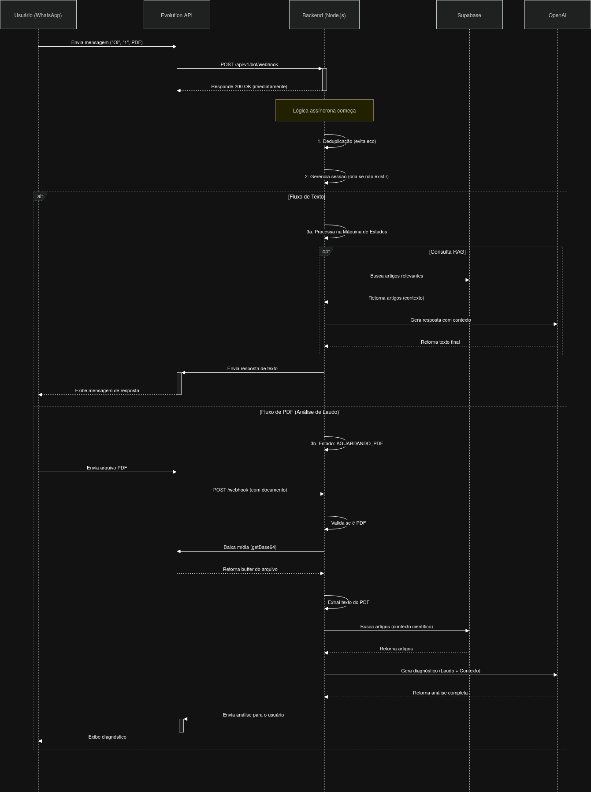

# Guia de Configuração e Arquitetura do Guia Regenerativo

Este documento serve como um guia completo para configurar o ambiente de desenvolvimento e entender a arquitetura interna do bot assistente da Agrominas.

---

## 1. ⚙️ Configuração do Ambiente (Passo a Passo)

Siga estas etapas para configurar e executar o projeto localmente.

### Pré-requisitos

Antes de começar, garanta que você tenha os seguintes softwares instalados:

- **Node.js**: Versão 18 ou superior.
- **Docker e Docker Compose**: Para orquestrar os contêineres da aplicação e da API do WhatsApp.
- **Conta no Supabase**: Utilizado como nosso banco de dados PostgreSQL e para armazenamento de vetores.
- **Conta na OpenAI**: Necessária para obter uma chave de API para o modelo de linguagem (GPT).

### Passo 1: Clonar o Repositório

```bash
git clone <URL_DO_REPOSITORIO>
cd <NOME_DO_REPOSITORIO>
```

### Passo 2: Configurar Variáveis de Ambiente

Crie um arquivo chamado `.env` na raiz do projeto. Este arquivo centraliza todas as chaves de API e configurações sensíveis.

```bash
touch .env
```

Copie e cole o conteúdo abaixo no arquivo `.env`, substituindo os valores `SUA_CHAVE_*` pelas suas credenciais:

```env
# Supabase - Encontrado nas configurações do seu projeto no Supabase
SUPABASE_URL=SUA_URL_DO_PROJETO_SUPABASE
SUPABASE_KEY=SUA_CHAVE_PUBLICA_ANON_SUPABASE

# OpenAI - Obtido no dashboard da OpenAI
OPENAI_API_KEY=SUA_CHAVE_DE_API_DA_OPENAI

# Evolution API (WhatsApp) - Configuração padrão do Docker Compose
EVOLUTION_URL=http://localhost:8081
EVOLUTION_API_KEY=SUA_CHAVE_SECRETA_PARA_EVOLUTION_API # Pode ser qualquer string segura
```

### Passo 3: Configurar o Banco de Dados (Supabase)

O esquema do banco de dados é gerenciado por arquivos de migração SQL.

1.  **Acesse o Supabase**: Faça login no seu painel do Supabase.
2.  **Abra o Editor SQL**: No menu lateral, vá para `SQL Editor`.
3.  **Execute as Migrações**: Copie o conteúdo de cada arquivo `.sql` da pasta `backend/src/database/migrations` e execute na ordem numérica.
    - `001_schema_inicial.sql`
    - `002_unique_titulo.sql`
    - `003_unique_insumos_nome.sql`

Isso criará as tabelas `artigos`, `categorias`, `insumos_regenerativos` e as tabelas de relacionamento.

### Passo 4: Iniciar a Aplicação com Docker

O `docker-compose.yml` na raiz do projeto foi configurado para iniciar o backend e a API do WhatsApp (Evolution API).

1.  **Construir e Iniciar os Contêineres**:
    ```bash
    docker-compose up --build
    ```
2.  **Aguarde a Inicialização**: O backend estará disponível em `http://localhost:3000` e a Evolution API em `http://localhost:8081`.

### Passo 5: Conectar o WhatsApp

A Evolution API possui uma interface visual para facilitar o gerenciamento das instâncias.

1.  **Acesse o Gerenciador**: Abra o navegador e vá para `http://localhost:8081/manager`.
2.  **Login**: Utilize a `EVOLUTION_API_KEY` que você configurou no seu arquivo `.env` para entrar.
3.  **Crie uma Instância**:
    - Clique em "Nova Instância" ou "Create Instance".
    - Dê o nome de `agrominas` para a instância (conforme configurado no backend).
    - Certifique-se de que a opção de QR Code está ativada.
4.  **Conectar via QR Code**:
    - Após criar, clique na instância `agrominas`.
    - Um QR Code aparecerá na tela.
    - Abra o WhatsApp no seu celular, vá em `Aparelhos conectados` > `Conectar um aparelho` e escaneie o código da tela.
5.  **Configurar Webhook**:
    - Dentro das configurações da instância no manager, vá na aba "Webhook".
    - Ative o Webhook.
    - Configure a URL para: `http://host.docker.internal:3000/api/v1/bot/webhook` (ou o IP da sua máquina na rede local).
    - Selecione o evento `MESSAGES_UPSERT`.

Pronto! Seu bot está oficialmente conectado e pronto para receber mensagens.

Pronto! Seu ambiente está configurado. O bot já deve estar respondendo no número de WhatsApp conectado.

---

## 2. 🧠 Arquitetura e Funcionamento Interno

Esta seção detalha o fluxo de dados e a lógica de negócios do bot.

### Diagrama de Fluxo da Mensagem

<div align="center">

[](../../assets/diagrama-sequencial.png)

<sub>_(Clique na imagem para expandir)_</sub>  
<sub>Fonte: Elaborado pelos autores, 2026.</sub>

</div>

### Detalhamento do Fluxo

1.  **Recebimento da Mensagem (`receberMensagem`)**
    - Toda mensagem enviada ao número de WhatsApp é recebida pela **Evolution API**, que a encaminha para o endpoint `POST /api/v1/bot/webhook` no nosso backend.
    - **Deduplicação**: A primeira coisa que o controller faz é verificar se o ID da mensagem já foi processado. Isso evita que o bot responda várias vezes caso a API reenvie o mesmo evento.
    - **Resposta Imediata**: O backend responde `200 OK` imediatamente para a API, sinalizando que a mensagem foi recebida. O processamento pesado (consultas, IA) acontece de forma assíncrona para não causar timeout.

2.  **Gerenciamento de Sessão e Estado**
    - O `bot.controller.js` utiliza um objeto em memória (`sessoes`) para guardar o estado da conversa de cada usuário, usando o `remoteJid` (identificador único do usuário) como chave.
    - Se um usuário é novo, uma nova sessão é criada no estado `PRINCIPAL`.
    - A cada mensagem, o bot consulta o estado atual do usuário para decidir como interpretar a entrada.

3.  **Máquina de Estados (`switch (sessao.estado)`)**
    - O coração do bot é uma `switch` que direciona a lógica com base no estado atual do usuário (`PRINCIPAL`, `INSUMOS`, `AGUARDANDO_PDF`, etc.).
    - **Transições**: Com base na entrada do usuário (ex: digitar "1"), o estado da sessão é atualizado (ex: de `PRINCIPAL` para `INSUMOS`), e a mensagem do próximo menu é preparada.

4.  **Busca Aumentada por Recuperação (RAG) - `rag.service.js`**
    - Para responder a perguntas sobre insumos, culturas ou temas de solo, o bot não consulta a IA diretamente com conhecimento genérico.
    - **Recuperação**: Primeiro, o `rag.service.js` busca na nossa base de dados **Supabase** por artigos e trechos de conteúdo que sejam relevantes para a pergunta do usuário.
    - **Aumento**: Esse conteúdo recuperado é injetado no prompt enviado à **OpenAI** como "contexto científico".
    - **Geração**: A IA então gera uma resposta fundamentada _exclusivamente_ no contexto fornecido, garantindo que as recomendações sejam precisas e alinhadas ao conhecimento da Agrominas.

5.  **Fluxo de Análise de PDF**
    - Quando o usuário entra no estado `AGUARDANDO_PDF`, o bot fica esperando por um arquivo.
    - **Download**: Ao receber um documento, a função `baixarMidia` em `whatsapp.service.js` chama o endpoint `/chat/getBase64FromMediaMessage` da Evolution API para obter o arquivo.
    - **Extração**: A biblioteca `pdf-parse` é usada no `pdf.service.js` para extrair o texto bruto do laudo.
    - **Análise com RAG**: Assim como no fluxo de texto, o bot busca artigos sobre "análise de solo" e combina o texto extraído do PDF com o contexto científico para que a OpenAI gere um diagnóstico completo e recomendações de insumos.
    - **Segurança**: Se o PDF não tiver texto legível (ex: for uma imagem escaneada), o fluxo é interrompido e o bot informa o usuário, evitando erros.

Este design garante que o bot seja robusto, tolerante a falhas e forneça respostas sempre baseadas na base de conhecimento curada, mantendo o controle sobre a qualidade da informação.
